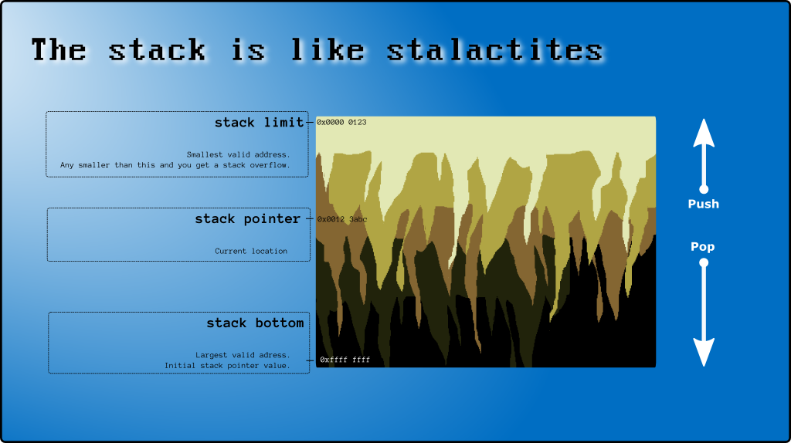
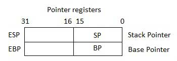

## Syntax variants 
```
GAS  - uses the AT&T syntax a relatively archaic syntax
NASM - uses the Intel syntax
```

## GAS example (AT&T)

A simple program that exits 2
```asm
.section .data
.section .text
.globl _start

_start:
    movl $1, %eax
    movl $2, %ebx
    int $0x80
```

use the as compiler, and ld linker
```bash
as -o exit.o exit.s
ld -o exit exit.o 
```


## NASM example (Intel)

A simple program that exits 2
```nasm
section .data
section .text
global _start

_start:
    mov eax,1
    mov ebx,2
    int 80h
```

use the nasm compiler, and ld linker
```bash
nasm -f elf32 -o exit.o exit.asm
ld -m elf_i386 -o exit exit.o 
```

## Sections and entry point
```nasm
section.data      ; stores constants 
section.bss       ; stores variables
section.text      ; stores the actual code
```
```nasm
global _start     ; tells the kernel where the program entry point is, and it's a label _start 
_start            ; the label where the program execution is pointed to 
```

## Statements 

Statements are as follows, the fields in square brackets are optional
```nasm
[label]   mnemonic   [operands]   [;comment]
```

## Mnemonics

A mnemonic is basically an assembly verb
```nasm
INC   ; Increment a value in a register
MOV   ; Transfer a value to a register
ADD   ; Add the content of a register to another register
AND   ; perform AND operation between registers
```

## Memory Segments

Data Segment: 
```nasm
section .data ; constants - static memory section, stores constants for the program
section .bss  ; variables - static memory section, contains buffers,  
              ; for variables to be declared later in the execution of the program
              ; bss stands for block starting symbol
```

Code Segment:
```nasm
section .text ; static memory section that stores the instruction codes of the program
```

Stack Segment:
```nasm
; the stack contains the data, values passed, and return addresses of
; functions, procedures, and subroutines within the program
; this is a stack and as such this is a LIFO structure
; it also generally has a static per program size
```

    

  


## Data Registers

  

```
There are 4 32 bit data registers, that can be used as: 
Full-32 bit:           EAX, EBX, ECX, EDX
16-bit lower halves:    AX,  BX,  CX,  DX
8-bit higher halves:    AH,  BH,  CH,  DH
8-bit lower halves:     AL,  BL,  CL,  DL
```
```
A -> Accumulator - primary accumulator, used in i/o and most arithmecal operations 
B -> Base        - could be used in indexed addressing
C -> Counter     - stores the loop counter in iterative operations
D -> Data        - also used in i/o
```

## Pointer Registers

  

```
There are 3 32 bit pointer registers:
Full-32 bit:           EIP, ESP, EBP
16-bit lower halves:    IP,  SP,  BP
```
```
IP -> Instruction Pointer - stores the offset address of the next instruction
SP -> Stack Pointer       - stores the offset within the program stack
BP -> Base Pointer        - stores param variables passed to a subroutine
```


## Index Registers 

  

```
There are 2 32 bit index registers:
Full-32 bit:           ESI, EDI
16-bit lower halves:    SI,  DI
```
```
SI -> Source Index      - used as a source index for string operations 
DI -> Destination Index - used as a destination index for string operations 
```

## Control Registers

The 32-bit instruction pointer register (IP) and the 32-bit flag register combined are considered as the control registers.


Flag register:
```
OF - Overflow Flag
DF - Direction Flag
IF - Interrupt Flag
TF - Trap Flag
SF - Sign Flag
ZF - Zero Flag
AF - Auxiliary Carry Flag
PF - Parity Flag
CF - Carry Flag
```

## Segment Registers

```
Segments are specific areas defined in a program for containing: 
data, code and stack. There are three main segments
```
```
CS -> Code Segment   - 16-bit - contains the starting address of the code segment
DS -> Data Segment   - 16-bit - contains the starting address of the data segment
SS -> Stack Segment  - 16-bit - contains the starting addresss of the stack 
ES -> Extra Segment  - 16-bit - Extra segments 
FS -> Extra Segment  - 16-bit - Extra segments 
GS -> Extra Segment  - 16-bit - Extra segments 
```

```nasm
```

```nasm
```

```nasm
```

```nasm
```

## Write Hello World in x86 Intel assembly

```nasm
section .text:

global _start

_start:
    ; as per instructions in the man 2 write page
    mov eax, 0x4              ; use the write syscall -> number 4
    mov ebx, 1                ; use stdout for the fd
    mov ecx, message          ; use the message as the buffer
    mov edx, message_length   ; and supply the length
    int 0x80                  ; interupt the program an run our write syscall

    ; now gracefully exit
    mov eax, 0x1
    mov ebx, 0
    int 0x80

section .data:
    message: db "Hello World!", 0xA  ; db -> define bytes, message is the name of the variable
                                     ; 0xA hex = 10 ordinal = \n char
    message_length equ $-message     ; $- notation will be dynamically interpreted
                                     ; by nasm as the length of the message variale
```

find the docs for what we're talking about
```bash
locate unistd_32.h
man 2 write
man 2 exit 
```

compile
```bash
nasm -f elf32 -o hello-world.o hello-world.asm
ld -m elf_i386 -o hello-world hello-world.o 
```
